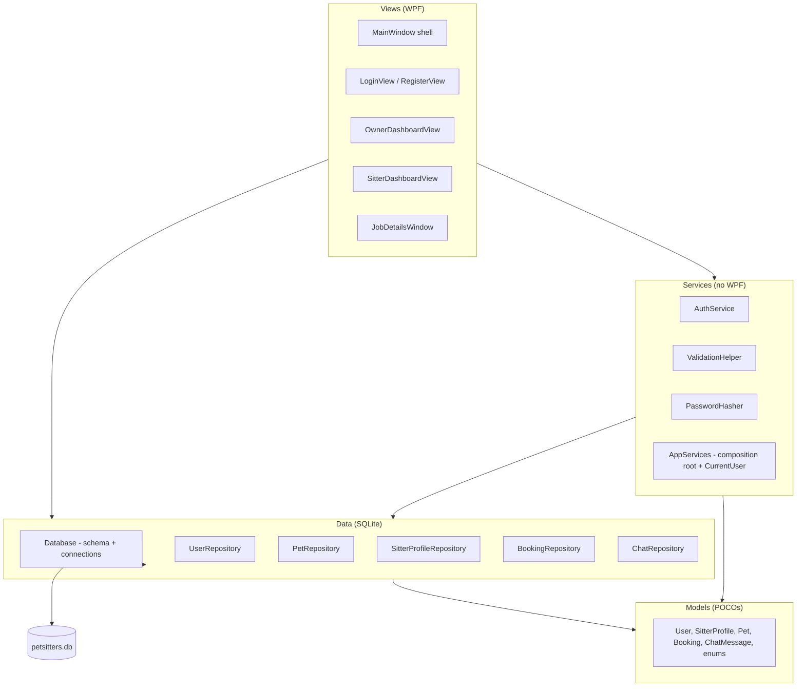
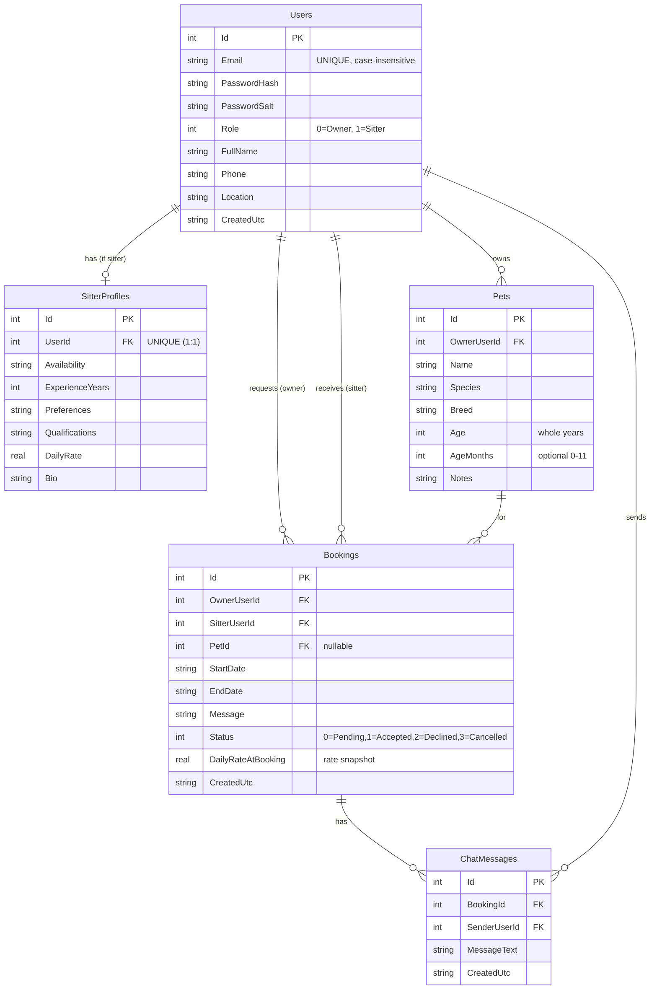
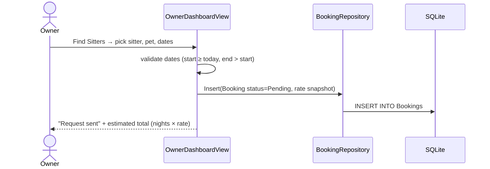

# Sitters4Us — Application Architecture & Design

Technical documentation for the Sitters4Us prototype: what it does, how it is
structured, its data model, and how the main workflows run.

> Product/brand name: **Sitters4Us**. Visual Studio assembly & namespace:
> **`PetSitters`**.

---

## 1. Overview

Sitters4Us connects **pet owners** with **pet sitters**. Owners register their
pets and browse sitters; sitters advertise availability, experience, and a daily
rate; owners send booking requests that sitters accept or decline; once a booking
is accepted the two parties can chat.

It is a single-user **desktop application** (WPF) storing all data locally in a
**SQLite** file — no server or internet connection is required.

### Technology stack

| Concern | Choice |
|---------|--------|
| Language / runtime | C# on .NET Framework 4.7.2 |
| UI | WPF (XAML), classic (non-SDK) project |
| Persistence | SQLite via `System.Data.SQLite.Core` (NuGet) |
| Password hashing | PBKDF2 (`Rfc2898DeriveBytes`, SHA-256, 100k iterations) |
| Tests | MSTest; FlaUI for UI automation |

---

## 2. Solution structure

```
PetSitters.sln
├── PetSitters/                 The WPF application (assembly "PetSitters")
│   ├── App.xaml(.cs)           Startup: builds AppServices, opens MainWindow
│   ├── MainWindow.xaml(.cs)    Shell: top bar + swaps the active view
│   ├── Models/                 Plain data objects (POCOs)
│   ├── Data/                   SQLite: Database + one repository per table
│   ├── Services/               UI-independent logic (auth, validation, hashing)
│   └── Views/                  One WPF UserControl per screen
├── PetSitters.Tests/           Logic + integration tests (MSTest)  → docs/UnitTests.md
└── PetSitters.UiTests/         End-to-end UI automation (FlaUI + MSTest)
```

### Layered architecture

The golden rule: **business/data logic never depends on WPF**, so it can be
tested without a window.



- **`App.xaml.cs`** creates `AppServices.CreateDefault()` once at startup and
  injects it into `MainWindow`.
- **`AppServices`** is a simple composition root: it builds the `Database` and the
  repositories, exposes them plus `AuthService`, and holds the logged-in
  `CurrentUser` (the session).
- **`MainWindow`** hosts a `ContentControl` and swaps `UserControl` views:
  login → register → an owner or sitter dashboard depending on `CurrentUser.Role`.

---

## 3. Screens

| View | Role | Tabs / purpose |
|------|------|----------------|
| `LoginView` | anyone | Email + password login |
| `RegisterView` | anyone | Create an Owner or Sitter account (personal details incl. location) |
| `OwnerDashboardView` | Owner | **My Details** · **My Pets** · **Find Sitters** (browse + request booking) · **My Bookings** |
| `SitterDashboardView` | Sitter | **My Details** · **My Sitting Profile** (availability, experience, rate…) · **Booking Requests** (accept/decline) · **My Chats** · hidden **Chat** panel |
| `JobDetailsWindow` | Sitter | Pop-up showing a request's full pet + owner details before deciding |

---

## 4. Data model

All data lives in one SQLite file at **`%AppData%\PetSitters\petsitters.db`**,
created on first run by `Database.Initialize()` (safe to call every startup).



Notes:
- **Shared `Users` table** for both roles; role-specific data lives in
  `SitterProfiles` (sitters, 1:1) and `Pets` (owners, 1:many).
- **`DailyRateAtBooking`** snapshots the sitter's rate at request time so the
  owner's estimated cost is stable even if the sitter later changes their rate.
- **Foreign keys are enforced** (`ForeignKeys=True`), with `ON DELETE CASCADE`
  (and `SET NULL` for a booking's optional pet).
- **Pet age** is stored as whole years (`Age`, required) plus optional months
  (`AgeMonths`, 0–11). `Pet.AgeDisplay` renders the pair for the UI
  (e.g. "2 years 3 months", "5 months").
- Dates are stored as ISO-8601 round-trip strings.

### Schema migrations

`CREATE TABLE IF NOT EXISTS` only shapes a *new* database, so columns added after
a release are patched into existing files by `Database.ApplyMigrations()`, which
runs at the end of `Initialize()`. Each step checks `PRAGMA table_info` first and
is safe to re-run (e.g. `Pets.AgeMonths` is added via `ALTER TABLE` when missing,
defaulting existing pets to 0 months). Add new column changes there so existing
`petsitters.db` files keep working.
- Enums live in `Models/Enums.cs`: `UserRole`, `BookingStatus`.

### Repositories

One repository per aggregate, each taking the `Database`:

| Repository | Key methods |
|------------|-------------|
| `UserRepository` | `EmailExists`, `Insert`, `UpdateDetails`, `FindByEmail`, `FindById`, `GetByRole` |
| `PetRepository` | `Insert`, `Delete`, `GetByOwner` |
| `SitterProfileRepository` | `GetByUserId`, `Upsert` (insert-or-update, 1:1) |
| `BookingRepository` | `Insert`, `UpdateStatus`, `GetForOwner`, `GetForSitter`, `GetById` |
| `ChatRepository` | `Insert`, `GetForBooking` (chronological, per-booking scoped) |

---

## 5. Key workflows

### Account creation & login (FR-A1 / FR-A2)

`AuthService.Register` validates input — **all registration fields are required**:
a valid email, a password of at least 6 characters, full name, phone, and
location. It then rejects duplicate emails (case-insensitive), hashes the
password, and inserts the user. `AuthService.Login` verifies the password hash and returns the
same error for "unknown email" and "wrong password" (no user enumeration). Both
return an `AuthResult` (`Success` / `ErrorMessage` / `User`).

### Owner requests a booking (FR-O4)



### Sitter responds and chats (FR-S4 / FR-S5)

The sitter sees pending requests under **Booking Requests**, can open
**View details** (`JobDetailsWindow`), and **Accept**/**Decline** (updates
`Bookings.Status`). Accepted bookings appear under **My Chats**; opening one shows
the per-booking **Chat** panel backed by `ChatRepository`.

> **Known WIP:** owner-side chat (FR-O5) is not yet built — only the sitter can
> open the chat UI. The chat data layer already supports both directions and is
> tested.

---

## 6. Security & quality properties

| Property | How it is achieved |
|----------|--------------------|
| No plaintext passwords | PBKDF2 salted hashing in `PasswordHasher`; only hash+salt stored |
| No account enumeration | Identical login failure message for unknown email vs wrong password |
| SQL injection resistance | All queries use parameterised SQLite commands |
| Chat privacy | Messages scoped to a booking; retrieval is per-`BookingId` |
| Referential integrity | SQLite foreign keys enabled with cascade rules |
| Testability | Logic layer has no WPF dependency; `Database` path is injectable |

See `docs/UnitTests.md` for the test suite that verifies these.

---

## 7. Building & running

The main app is a **classic WPF project that `dotnet build` cannot compile** — use
Visual Studio MSBuild. The SDK-style test projects build with `dotnet` afterwards.

```bash
# Build the app (Visual Studio MSBuild)
"C:\Program Files (x86)\Microsoft Visual Studio\2022\BuildTools\MSBuild\Current\Bin\MSBuild.exe" PetSitters.csproj /t:Restore,Build /p:Configuration=Debug

# Run
bin\Debug\PetSitters.exe

# Logic tests (after the app is built)
dotnet test PetSitters.Tests -c Debug
```

Or open `PetSitters.sln` in Visual Studio and use **Test → Run All Tests**.

**Reset all data:** delete `%AppData%\PetSitters\petsitters.db` and relaunch.

---

## 8. Extending the app

- **New screen:** add a `UserControl` under `Views/`, register it in
  `PetSitters.csproj` (`<Page>` + `<Compile>` — classic projects don't auto-include),
  and navigate to it from `MainWindow`.
- **New persisted data:** add a POCO in `Models/`, a `CREATE TABLE IF NOT EXISTS`
  in `Database.Initialize()`, and a repository in `Data/`; expose it from
  `AppServices`.
- **New logic:** put it in `Services/` (UI-independent) and add tests in
  `PetSitters.Tests` so it stays verifiable.
