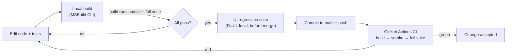

# Continuous Integration & quality gates

How Sitters4Us is built, tested and integrated, and which automated checks
must pass before a change counts as done. (Supports ENSE707 Task 5.)

---

## Development & integration workflow



- The team works on `main`, with one commit per requirement
  (e.g. *"Addressed REQ-GR-04: …"*), and pulls before pushing. Merge conflicts
  are resolved locally and re-tested before pushing.
- **Locally**, building the app from the command line also runs the tests (see
  below), so a change can't "build" while breaking a test.
- **On every push and pull request to `main`**, the CI workflow
  [`.github/workflows/ci.yml`](../.github/workflows/ci.yml) re-runs the gates on a
  clean Windows machine and reports the results on the commit or PR.

## Quality gates

| # | Gate | Where | Fails when |
|---|------|-------|-----------|
| 1 | **Successful build** | CI + local | The WPF app doesn't compile (Release in CI). |
| 2 | **Smoke tests**: 8 tests tagged `Smoke` | CI + local build | Any core path is broken: password hashing, register, log in (< 1 s), schema/migration start-up, booking request, accept, chat persistence. |
| 3 | **Full logic + integration suite**: 184 cases | CI + local build | Any unit or integration test fails. |
| 4 | **UI regression suite**: 6 FlaUI tests | Local, before merge | An end-to-end journey breaks (see below for why it isn't in CI). |

Gates run in order and **stop at the first failure**. Smoke runs before the
full suite deliberately: it takes about 3 s against about 37 s, so a badly
broken build is reported quickly.

**Evidence that the gate actually gates (2026-10-02):** the minimum password
length was temporarily changed from 6 to 5. The build ran the tests, two
boundary tests failed (`IsValidPassword_EnforcesMinimumLengthBoundary("12345")`,
`Register_WithWeakPassword_Fails`), and **the build failed**
(`error MSB3073 … exited with code 1`). The change was then reverted.

### Gates not enforced (and why)

| Gate | Status | Reason / how to add |
|------|--------|---------------------|
| Linting | Not gated | The app is a classic .NET Framework csproj that `dotnet format` can't analyse. Roslyn analysers could be added later. |
| Code review | Not enforced by tooling | Two-person team working on `main`. It could be enforced with GitHub branch protection (require a PR, one review, and CI green before merge). That's a repository setting, not code. |
| Coverage threshold | Not gated | Coverage tooling for .NET Framework 4.7.2 adds setup cost. Requirement coverage is tracked instead through the traceability matrix in `UnitTests.md`. |

## Smoke / sanity testing

The smoke set is a deliberately small slice through the main user journey, at
service level:

| Smoke test | Proves |
|-----------|--------|
| `CreateHash_ThenVerifyWithCorrectPassword_ReturnsTrue` | Password hashing works |
| `Initialize_RunTwice_IsIdempotent` | Database schema and migrations start up cleanly, including on an existing database |
| `Register_WithValidDetails_Succeeds` | An account can be created |
| `Login_WithCorrectCredentials_SucceedsWithinPerformanceBudget` | That account can log in, in under 1 s |
| `RequestBooking_ValidSubmission_IsStoredAsPending` | An owner can request a booking |
| `Insert_BookingIsVisibleToBothOwnerAndSitter` | The sitter sees it |
| `AcceptRequest_WithNoClash_AcceptsAndPersists` | The sitter can accept it |
| `Message_IsPersisted_AndReadBackByAFreshRepository` | Chat messages are saved |

Run just the smoke set with:
```
dotnet test PetSitters.Tests -c Debug --filter TestCategory=Smoke
```

## Why the UI suite runs locally, not in CI (alternative workflow)

The FlaUI suite drives the **real desktop**: it moves the mouse, types and
reads the screen. Hosted CI runners have no reliable interactive desktop.
The suite is also currently affected by a known layout defect (the login screen
is clipped at the default 920×640 window) and fails if anyone uses the mouse
mid-run. Running it in CI would make the pipeline red for reasons unrelated to
the change being tested.

So the UI suite is a **manual pre-merge gate**: whoever changes a view runs it
locally before pushing (`dotnet test PetSitters.UiTests`), and it saves a
screenshot of any failure. A self-hosted Windows runner with an
auto-logged-in desktop session would allow it to move into CI later.

## How to run everything

| What | Command |
|------|---------|
| Build + smoke + full suite (local gate) | `MSBuild.exe PetSitters.csproj /t:Restore,Build /p:Configuration=Debug` |
| Build only | add `/p:SkipTests=true` |
| Full suite only | `dotnet test PetSitters.Tests -c Debug` |
| UI regression suite | `dotnet test PetSitters.UiTests -c Debug` (interactive desktop; don't touch the mouse) |
| CI | Automatic on push or PR to `main`; manual via **Actions → CI → Run workflow** |

Building inside **Visual Studio** does *not* run the tests: Test Explorer does
that, and running the full suite on every F5 would slow development down. Test
results are written as `.trx` files to `TestResults/` (git-ignored). CI uploads
them as the `test-results` artifact and summarises them on the run page.
